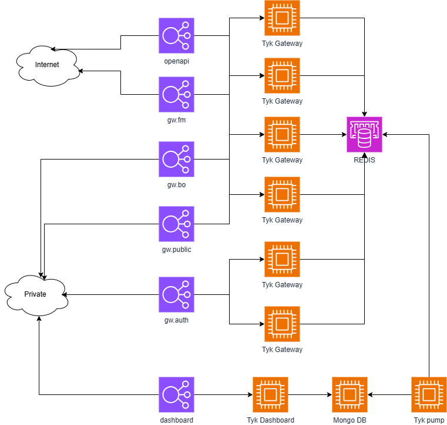
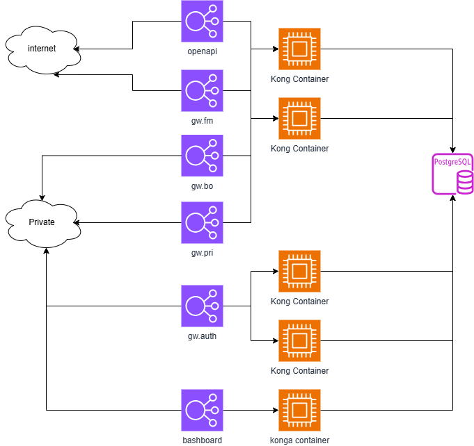
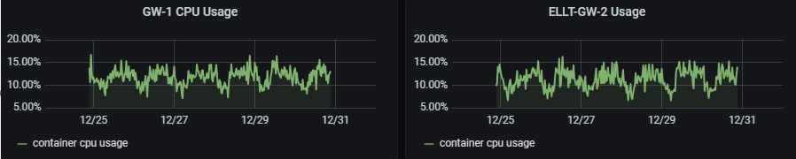
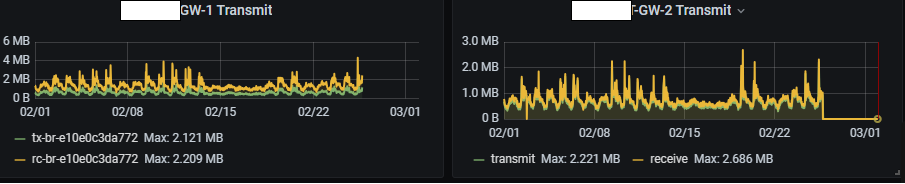
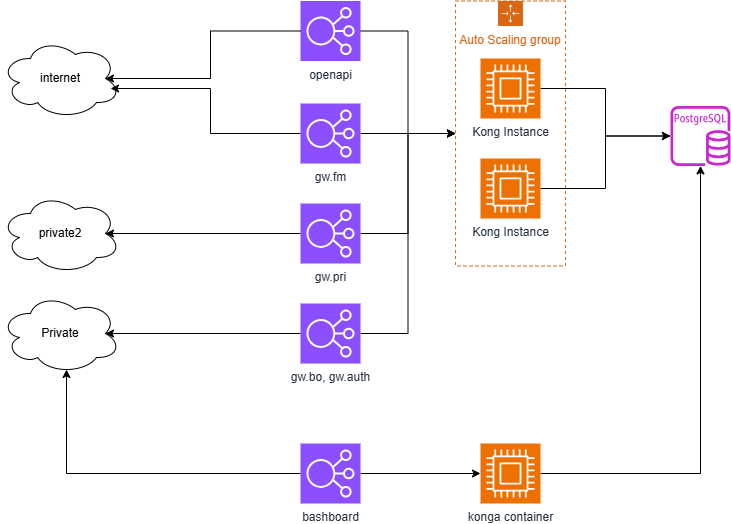

API Gateway migration 
========================

1st Gen
----------
##### Aim problem
1. Reduce TCO of API Gateway
2. Compability of URL Proxying

##### Reduce TCO of Tyk 
2022년과 2023년 사이에 Tyk는 가격 정책을 변경하면서 기존보다 2배이상의 연간 라이선스 비용을 요구하려 했습니다. 
그래서 저희는 tyk를 대체할 수 있는 다른 API Gateway를 찾았고 AWS API Gateway와 KrakenD와 kong을 비교했고, kong을 선택하게 되었는데 이유는 Kong과 Konga를 \
조합하면 적당한 GUI 환경을 사용하면서 Tyk 대비 0원에 가까운 비용으로 유지를 할 수 있다는 계산과 API  인건비는 tyk이든 kong이든 동일하기 때문입니다.

tyk 다이어그램

Tyk를 사용할 때는 mongodb를 저장소로 사용하는데 여기에 설정이 된 정보를  tyk pump를 이용해서 AWS Elasticache for REDIS (REDIS)에 저장합니다. 
이 REDIS에 저장된 설정을 Tyk Gateway들이 읽어들인 후 서비스 하게 됩니다. 
Tyk는 전면에 나서는 Gateway , 서버를 설정하고 여러 지표를 볼 수 있는 Dashboard, Dashboard와 Gateway 사이 매개체로 쓰이는  Redis에 업데이트를 하는 pump로 
구성이되어 있습니다. 데이터 저장소로는 MongoDB를 사용합니다. 
우린 6대의  m5.xlarge 로 구성된 gateway와 m5.xlarge로 Tyk Dashboard, MongoDB, Tyk Pump, 그리고 m5.xlarge 스펙으로 HA 구성이 된 AWS Elasticache for Redis 를 
사용해서 구성했습니다. 
인스턴스와 Redis를 기준으로 계산되는 예상 비용은 연간 약 $18400($1,533x12) 입니다. 

 | resource | type | Qty | Unit price/month | amount / month |
 | --- | --- | --- | --- | --- |
 | EC2              | m5.xlarge          | 9 | $107 |  $963 |
 | ElastiCache | cache.m5.xlarge | 3 | $190 | $570 |
 |계|||| $1,533|

 (표 1.Tyk 사용시 예상 인스턴스 비용)
 
 
kong 다이어그램

Tyk에서 Kong 이전을 결정하고 제일먼저 한 일은 Authentication에 대한 정책을 변경했습니다.
 트래픽의 99%가 내부에서 발생하는 트래픽이었기 때문에 별도의 인증을 거치지 않고 방화벽에서 통신을 제어하는 것으로 인증을 대신했습니다.
때문에  Cunsumer와  Credentials 에 대한 부담이 없는 상태로 API Proxy 규칙을 이전하는 코드를 개발 했습니다.

월간예상비용

 | resource | type | Qty | Unit price/month | amount / month |
 | --- | --- | --- | --- | --- |
 | EC2              |m5..xlarge          | 5 | $107 | $535|
| RDS               | db.t3.small      | 1 |  $32  | $32|
| 계||||$567|  

하지만 이런 작업의 결과 인프라 비용은 월간 $1,500 에서 $567로 Tyk 대비 **63%** 비용 절감 및 연간 $50,000의 라이선스 비용을 지출하지 않아도 되었습니다.
그리고 기존 Tyk 장애시엔  Tyk에 대한 모니터링 지점이 dashboard, mongodb, pump, redis,gateway로 총 5곳이었지만 kong으로 전환하면서 
kong gateway, postgresql, 두개로 줄어들어서 모니터링 지점이 줄었고, 장애 시 살펴봐야 하는 요소도 줄었습니다. 
목적이 비용 줄이기였던 만큼 해당 목적은 달성한 것으로 평가합니다. 
tyk의 총 운영비용이 연간 $70,000이었던 것을 연간 $6,800 정도로 절감시켜서 Tyk 대비 비용을 **90%**  절감했습니다. 

2nd Gen
-----------
 #### Purpose
1. Security Issue (using too old version)
2. Availability Issue (stand alone configuration)
3. AWS Classic Load Balancer migration

kong v2.1과 konga로 운영되던 시스템이 보안적인 이슈로 인해 최신 버전으로 업그레이드의 필요성이 소요되었고, 이 과정에서 비용 효율화를 위해서 용량 계획을 계산하게 되었습니다. 

##### Capacity planning
이전에 마이그레이션을 할 때 인스턴스 타입으로 m5.xlarge를 선택했었는데, 기존에 사용하던 m5.2xlarge가 사용량에 비해 너무 크다는 판단이 들어서 변경을 했습니다. 
  
서버의 버전을 업그레이드하기로 결정하고 이 때 할 수 있는 다른 연결된 태스크를 보니 산재되어 있고 사용하지 않는 URL들과 오래된 Classic LB들 그리고 평균적으로 10% 내외를 사용하는 
kong  서버들을 다시 살펴보게 되었습니다. 
지난 시간의 그래프들을 확인 해보니 CPU Utilization은 15에서 20% 정도를 사용하고 네트워크IO는  보통 2~3Mbps 수준으로 사용하고 있었습니다. 

*CPU 사용량* 

*네트워크 사용량*

위 그래프의 Usage 상태는 t3.medium 로 구성된 4대의 서버를 운영하면서 샘플링한 2개의 서버 입니다. 
 4대 모두 비슷한 사용량을 보이고 있지만  gw.auth의 경우 특히 낮은 Usage를 보이는 관게로 그리고 ASG를 이용해서 동적으로 수량을 관리하면 
 성능에 문제가 없을 것 같아서 이번 마이그레이션에서는 t3.medium을 사용하기로 했습니다. CPU CreditBalance를 모니터링 하면 인스턴스 타입에 대한 가이드가 될 것으로 판단했습니다.

##### 도에인 통합
API Gateway를 서비스 하는 도메인은 총 7개로 각각의 목적에 따라 분리되어 있었지만 시간이 지나 의미가 사라진 목적도 있어서 도메인을 3개로 통합 하는 작업을 수행했습니다. 
3개로 만든 기준은 출발지를 기준으로 3개로 구분했으며 가 Domain과 Context-path의 조합으로  ALB에서 Target Group(이하 TG)를 구분하도록 설정했습니다.
ALB로 마이그레이션을 하면 TG를 사용하기 때문에 HTTP Header , Context-path 등으로 트래픽을 구분할 수 있고 각 TG별 메트릭을 활용해서 모니터링을 고도화 할 수 있습니다. \
**ALB로 이전을 하기 위해서는 [Classic Load Balancer 마이그레이션] 문서를 참고하시기 바랍니다**.
kong v2에서 v3로 이전을 위해서는 ALB의 Listener 에서 TG별 Weight를 이용해서 버전 간의 문제를 모니터링 하기로 했습니다. 
kong v2를 위한  TG를 생성해서 설정을 완료한 뒤 테스트를 후 모든 도메인의 CNAME과 A 레코드를 신규 LB를 가리키도록 변경하도록 했습니다. 
이 때 신규 LB는 kong v2를 가리키는 TG만 연결했습니다.이렇게 신규 LB에서 kong v2를 이용해서 서비스를 제공하도록 했습니다, 

###### kong upgrade
kong을 업그레이드 하기 위해서는 [deck]을 이용해서 수월하게 진행 할 수 있습니다. 

##### Kong v3(OSS) 적용
아래 다이어그램은 최종적으로 구성된 API Gateway의 구성입니다. 

기존에 구동되던 4대로 고정된 클러스터에서 AWS Auto Scale Group(이하  ASG)로 구성된 동적 클러스터로 변경하고 CPU Utilization과 Latency를 비교한 결과 2대로 줄었음에도 
Latency의 증가가 보이지 유의미하게 관측되지 않아서 4대에서 2대로 운영하기로 결정했습니다. 
관리목적의 konga 는 더이상 사용할 수 없어서 시스템에서 폐기하고 Kong manager를 필요할 때마다 켜서 사용하거나 Admin API를 직접 호출해서 사용하도록 정책을 정했습니다. 
결과적으로 v2 에서 v3로 이전하는 데에는 약 3개월 정도 시간이 소요되었습니다.  

월간예상비용

 | resource | type | Qty | Unit price/month | amount / month |
 | --- | --- | --- | --- | --- |
 | EC2              |m3..medium    | 3 | $23 | $69|
| RDS               | db.t3.small      | 1 |  $32  | $32|
| 계||||$101|  

기존에 5대에서 3대로 (관리용 1대)줄이면서 **53%** 절감효과를 달성했고  ASG를 이용한 **Auto healing 구현으로  RTTM은 5분 이내**로 달성하게 되었습니다. 
 Database의 SLA는 [Amazon RDS 서비스 수준 계약]을 따릅니다. 
 
 ###### 정리
인프라 월간비용변화
  
 | resource | type | Qty | Unit price | amount|
 | --- | --- | --- | --- | --- |
 |EC2  |  m5.xlarge | 9 | $107 |  $963 |
|ElastiCache | cache.m5.xlarge | 3 | $190 | $570 
|1차 합계|||| **$1,533** (100%)
| EC2              |m5..xlarge          | 5 | $107 | $535|
| RDS               | db.t3.small      | 1 |  $32  | $32|
| 2차 합계||||**$567** , 이전 대비 63%|  
| EC2              |m3..medium          | 3 | $23 | $69|
| RDS               | db.t3.small      | 1 |  $32  | $32|
| 2차 합계||||**$101** , 이전 대비 82% |  

*금액산정 시 기준:  EC2 Reserved Instance , no-upfront , 1year , exclude VAT*
 [Classic Load Balancer 마이그레이션]: https://docs.aws.amazon.com/ko_kr/elasticloadbalancing/latest/userguide/migrate-classic-load-balancer.html
 [Amazon RDS 서비스 수준 계약]: https://aws.amazon.com/ko/rds/sla/
 [deck]: https://developer.konghq.com/deck/
 