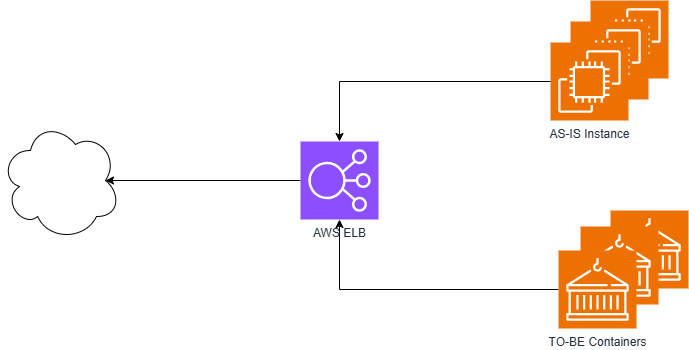
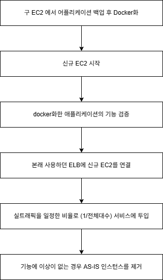

## 시스템을 줄인다는 것

##### 왜 시작하나?
서비스의 분리가 결정되고 나서 엔드 유저용 Front Site 가 사라진다는 소식이 들려오면서 서비스를 개편해야 하는 일이 발생했습니다. 
인프라의 주 설계 방향이 초대형 트래픽을 견디고 서비스를 할 수 있도록 구성되었는데, 이것을 이제 소규모 트래픽과 대용량 배치로 변경하는 
요구사항이 발생했습니다. 
기존엔 대부분의 서버가 Auto Scale out 조건에 맞춰 대수가 늘어났다가, 줄어들고 하면서 대용량 트래픽을 견딜 수 있게 했지만, 이제 이건 
돈 낭비의 주범이 되었고, 우리에게 필요한 건 fit 한 optimize 작업입니다. 예산은 줄어들고 인력도 줄어들고 서버 대수도 400대에서 150대 정도로 줄어듭니다. 

##### 무엇을 줄일 것인가? 
시스템 구성 요소를 줄이는 데 있어서 첫 번째 규칙은 "서비스에 지장을 주지 말 것" 두 번째는" 서비스 중 과한 스펙으로 된 부분을 제거하는 것"입니다. 
서비스가 우선이고 적절한 제거는 두 번째인데 이 과정에서 무엇을 얼마나 잘라낼 것인가는 항상 가슴 졸이는 상황입니다.
클라우드 환경에서는 하드웨어적 인프라를 설계하면 초기엔 항상 대용량 트래픽을 가정하고 설계한 후 시간이 지나면 자원을 제거합니다. 
이때 필요한 건 적절한 선택 그리고 선택을 위한 자원 모니터링과 통계적 분석을 통한 예측입니다. 이것을 Capacity Planning이라 합니다. 

##### 선택은 항상 귀찮다.
적절한 선택을 위해서 기준을 세워야 하는데 저는 서비스의 성격을 Compute와 IO 작업으로 구분했습니다. 
compute 작업의 목표는 CPU Usage를 일평균 15%로 IO 작업은 network bandwidth를 기준으로 50% 이내 , 
이 둘의 중간에 Memory와 Disk가 중요한 OLAP(Online Analysis Processor)로 구분했습니다. 일단 운영하는 서비스에는 고객용만 있는 게 아니라
내부에서 사용하는 유틸리티 적인 서비스들이 많습니다. 
git, Jenkins, maven, SMS (문자메시지 발송), ETL, 이미지 변경 등 뒷부분에서 존재하는 유틸리티 서비스들의 경우엔 CPU Usage를 기준으로 50% 정도로 
기준으로 잡았습니다. 이렇게 줄어들면 개발팀에 서버가 변경돼서 느려질 수 있다고 공지해 줘야 합니다. 
기준을 만드는 것도 어렵고, 기준대로 분류하는 건 귀찮습니다. 

##### 선택을 위해선 모니터링과 분석을 해야 한다.
서버나 서비스에 마다 아주 적절한 메트릭을 산정하기는 어렵습니다. 이때 필요한 건 H/W, S/W를 나누면 실패할 수 있다는 점을 알아야 합니다. 
여긴 도메인 지식과 traffic flow, data flow, Database의 특성, OLTP와 OLAP의 특성들이 모두 들어가야 합니다.
예로 어떤 서버의 peak 시 CPU Usage는 120%이지만 이게 하루 중 단 10분일 수도 있습니다. 어떤 서버는 꾸준하게 일평균 50%일 수도 있습니다. 
그래서 잘 살펴봐야 하는 부분은 S/W의 특성에 맞춰 H/W가 최적화되어 있는가? H/W를 어느 수준으로 변경해야 하는가 하는 결단이 필요합니다. 
기결단에는 수집한 Metric이 참고되지만 결정할 순 없습니다. 서비스의 특징에 맞춰 적당한 사양을 고르는 건 직감의 영역입니다. 

설계 당시엔 H/W를 통일한다는 명목으로 EC2 인스턴스 Family를 통일하고 그 안에서 Type을 선택했습니다. 
그러다 보니 스펙이 과장된 서비스들도 많아서 이번 기회에 적절한 스펙으로 맞추고 싶어졌습니다. 

그래서 저는 이번엔 Response Time의 P99를 참고로 해서 서비스하는 OLTP 영역에서의 목표 수치를 기존에는 평균 0.01 sec의 목표를 0.5sec으로 늘리는
것을 목표로 삼았습니다. 왠지 이것이 CPU/Memory/Disk IO/Network IO를 개별로 보는 것보다는 서비스 그 자체를 나타내는 수치라고 생각했습니다. 
서비스의 품질은 응답시간(Response Time)에 달려있기 때문에 이번 다운사이징의 목표는 다운사이징 대상 서비스들의 응답시간은 0.5sec 이내로 높이는 것이 목표가 되었습니다.
화면에서 고객이 발생시키는 하나의 Request는 보통 서비스별로 4개의 Request로 구분됩니다. 화면 -> API G/W -> API -> DB
Request마다 Response Time이 1sec 라면 하나의 요청에 4sec이 소요되는데 0.5sec 라면 2sec 이내에 결과를 제공하기 때문에 서비스에는 문제가 없을 거라 
생각했습니다. 이제 서비스는 시간과 품질을 다투는 것이 아니라 정확한 응답이 중요해졌습니다. 품질 체계에서 속도는 2순위가 되었기 때문에 선택한 전략입니다. 그래서 먼저 AWS CloudWatch에서 CPU Utilization과 P99를 추출했습니다. 
EC2 인스턴스의 경우 Network나 Disk의 경우 아주 낮은 타입의 인스턴스에서도 어느 정도의 성능이 보장되기 때문에 무시하기로 했습니다. 
CPU Utilization과 P99의 상관관계를 보면서 직감적으로 와닿은 부분은 서버마다 스펙을 1/2, 1/3, 1/4 수준으로 책정해도 문제가 없을 것으로 보이는 
서비스들이 보였습니다. 
0.001sec의 Response Time을 보이는 서비스는 그렇게까지 빠르지 않아도 되는 서비스인 경우도 있고 1sec 정도 걸리는 서비스도 그것보다 더 느려도 되는 서비스였습니다. 
어떤 서비스는 0.01sec이지만 0.5sec의 Response Time도 충분한 서비스였습니다. 

물론 이 과정은 단순하게 숫자로 판단하기엔 관련 서비스의 전체적인 운영 방식도 알아야 하고 사용자들의 클릭스트림에 대한 이해도 필요한 작업입니다. 
그래서 1년 치 데이터를 모아서 1년을 기준으로 반기, 분기, 월, 주 단위로 스케일링하면서 peak은 언제 발생하는지 빈도는 어떤지, 그 peak은 사유가 정당한지, 
Auto Scale Group에서 peak에 대응해서 확장했는데 왜 특정 인스턴스에서 peak이 지속되는지 등의 상황을 분석했고, 가짜 peak과 같은 패턴을 찾았습니다. 
>가짜 peak : API로 데이터를 처리할 때 1개의 데이터에 1번 API 호출이 아니라, N개의 데이터를 1번의 호출로 처리하는 배치 성격으로 호출해서 특정 인스턴스에서만 peak이 지속되는 것

가짜와 진짜 peak을 찾고 패턴을 분석하며 특정 시기의 peak은 지연을 시켜도 서비스에는 지장이 없다는 결론에 이를 때까지 계속 분석해야 합니다.
이때 분석은 정말 지루하고 매일 비슷한 내용의 그래프를 보고 엑셀로 수치를 내려받아서 그 안에 다른 특이점은 없는지를 확인해야 합니다. 

##### 어떻게 줄일 것인가? 
이제 줄일 대상과 목표 스펙이 생겼으니 이제 만들어진 목록을 기준으로 하나씩 작업을 시작했습니다. 제 경우에는 OS를 업그레이드와 다운사이징을 동시에 하기로 했습니다. 
대략적인 작업의 순서는 OS를 변경하는 것과 동시에 예상한 스펙으로 type을 변경합니다. 
   그림 1. 다운사이즈 작업 기본 구조    
이 작업을 할 때 중점으로 한 부분은 OS를 업그레이드해야 하지만 기존에 구동 중인 애플리케이션에 영향을 주면 안 되고, 유지보수 계약이 더 이상 불가한 legacy 서비스들의 경우엔 신규 OS로의 이전이 
상당히 부담됩니다.
저는 이것을 Docker로 이용해서 해결하고자 했는데, 먼저 Docker hub에 해당 애플리케이션 이미지가 있는 경우엔 애플리케이션과 OS 모두를 업그레이드할 수 있었고
Docker hub에 없는 상용 애플리케이션의 경우에는 기존에 사용하던 EBS를 모두 Amazon Linux1 이미지에 이식해서 내부적으론 Amazon Linux1 이지만 외적으로는 Amazon Linux 2023에서 
구동되도록 했습니다. Docker container의 경우에 일반 OS와 다르게 경량화가 되어 있고, 불필요 daemon들이 제거되는 등 기존의 OS와 다른 전략을 취할 수 있지만, 환경은 동일하게 유지 할 수 있었습니다. 
따라서 이 두 가지 경우를 기준으로 아래의 순서로 작업을 진행하였습니다. 

  그림 2. 개괄적 작업 과정    
중점적으로 준비를 한 것은 기존과 동일한 기능을 제공하지만, 스펙이 낮아지고 Container로 구동되기 때문에 AS-IS와 비교해서 성능의 저하 범위를 
중점적으로 고려하기로 했습니다. 

##### 실제로 줄이는 과정
대상과 계획이 세워졌으니, 실제로 애플리케이션들을 docker로 전환하고 DNS 변경으로 작업할 대상과 ELB를 이용한 작업 대상은 분리했습니다.
애플리케이션은 Java 기반과 C/C+ 기반으로 분류해서 Java 기반은 openjdk 1.8 버전의 Docker image를 기준으로 작업하고 C/C++은 Amazon Linux1 Docker image를 
기준으로 작업 수행했습니다. 
애플리케이션이 사용하는 Datastore(directories, files)를 선별하는데 이 과정에서는 설정에 선언된 내용을 기준으로 선별하고 OS에서 기본으로 제공하는 
Socket이나 pipe 등의 특수 파일을 사용하는 예도 선별했습니다. 
이렇게 선별된 Path들을 Docker image에 적용하면서 Docker image에서 permament 하게 저장되어야 하는 부분과 시간이 지날수록 데이터가 쌓여야 하는 
영역을 구분해서 Dockerfile을 생성하고 이미지를 ECR에 push하고, 데이터 영역은 AWS EFS를 연동해서 데이터를 저장하도록 했습니다. 
이것을 설치된 애플리케이션마다 동일하게 진행하는데 애플리케이션 중에는 심하게 커스터마이즈 되고, 여러 이해관계가 얽혔지만, 유지보수가 안되는 애플리케이션들도
다수 있었기 때문에 모든 걸 완벽하게 옮기는 것은 어려운 부분이 있었고, 이 부분은 / (root) 전체를 Docker volume으로 처리해서 사용한 예도 있습니다. 

##### 결론
Vanila OS에 Native로 설치된 애플리케이션은 OS 업그레이드나 패치와 같은 작업이 부담스러울 수밖에 없습니다. 
그리고 서버가 공인 IP를 갖고 혹은 직접 DNS의 목표가 되어 있는 경우에도 부담이 있습니다. 
하드웨어에 세팅된 OS와 그 위에 애플리케이션을 바로 설치 한다면 쉽고 빠르게 전개할 수 있는 장점이 있지만 프로덕션 환경에서는 여러 가지 작업을 수행하는데
걸림돌이 됩니다. 처음부터 Docker와 같은 Container 환경에서 설치하고 운영을 했다면 애플리케이션을 이동시키는 게 큰 부담이 없을 수 있고, 
L4, L7과 같은 네트워크 장비 혹은 HA Proxy나 Nginx를 이용해서 접근을 위한 레이어를 하나 추가해 준다면 새롭게 추가되거나 삭제될 때도 
부담이 적을 수 있습니다. 
인프라를 구성할 때는 Container와 Proxy 같은 기법을 적극적으로 도입하는 것이 운영하는 게 있어서 부담을 덜어주는 선택입니다. 
