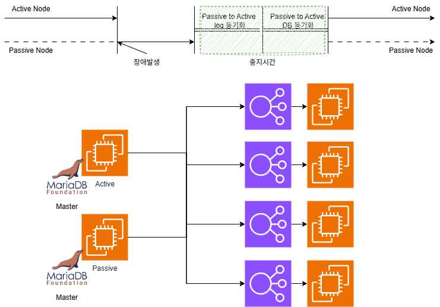
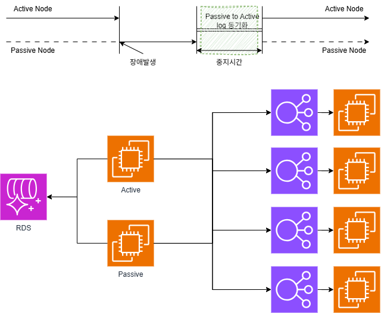
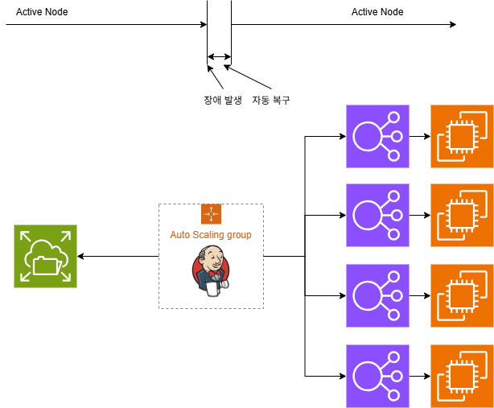

스케줄러 개선의 여정
=================

#### 무엇이 문제였나?
최초에 스케줄러를 구성할 때 공급업체가 있는 솔루션을 도입했습니다. 
비즈니스의 특성상 배치가 중요하지 않았던 시절의 요건은 단순했습니다.
사실 이 솔루션은 스케줄링만 하는 솔루션이 아니었기에 본래 기능인 ETL에 있는 스케줄러 기능을 이용해서 batch를 호출해서 하자는 
간단해 보이는 요구사항을 품어준 것입니다. 그런데 ETL도 Active-Passive 구조로 가야 하니까. 겸사겸사 가 가능해 보였습니다. 
그런데 첫 장애 발생 후 도출된 문제는 Active-Passive는 맞는데 자동은 아니었다는 겁니다. 
"서버가 중지되면 다른 예비가 작동하면 됩니다."라는 단순한 Active-Passive 구성이었습니다.


사람이 장애를 인지하면 직접 Passive 서버로 접속해서 Active 서버를 fencing하고 Passive 서버에서 ETL/스케줄링 프로세스를 실행시켜야 하는 
절차를 가지고 있었습니다. 
그리고 Passive 서버에서 ETL/스케줄링 작업 수행하다가 다시 Active 서버로 이전하려면 위의 과정을 역순으로 진행해야 합니다. 
Passive 서버를 중지하고 Passive 서버에서 수행된 모든 로그파일과 DB를 다시 Active 서버로 동기화한 다음 Active 서버에서 
ETL/스케줄링 프로세스를 실행시켜야 하는 Active-Passive 구조로 되어 있었습니다. 
이건 운영자가 24시간 대기하지 않는다면 장애 시간이 길어지는 것은 물론 Fail back을 위해서 모든 작업 중단해야 한다는 점입니다. 
장애 처리를 위해서 마지막에 또 장애를 가져야 한다니? 이건 개선점입니다. 


#### 1차 개선 
##### 일단 동기화를 줄여보자
개선하기 위해서 아래와 같이 구성했습니다. 일단 인수인계를 받은 내용으론 DB를 fail back 해야 하므로 전문 엔지니어가 와야 하고
다운 시간이 필요하다고 이야기했었기 때문에 저는 복원을 위해서 DB를 하나로 볼 수 있도록 구성했습니다. 
DB를 Master-replica로 구성한들 큰 의미는 없을 테고 차라리 하나의 DB를 바라보고 있도록 하는 게 서비스 복원 시간을 줄이는 데 효율적이라고 판단했습니다. 

이렇게 개선해서 DB 동기화 시간은 0초로 만들었습니다. 
그런데 다시 새벽 시간대에 장애가 발생하고 Fail back 하려는 시점에 또 엔지니어가 방문해야 하기 때문에 낮에 다시 다운타임을 가져야 한다는 내용을 접했습니다.
##### 복병이 있더라
이유는 ETL/스케줄러 프로세스가 만드는 히스토리성 자료들을 file로 생성한다는 이야기였습니다.
DB에 뭔가를 기록하고 그걸 동기화한다고 하더니 file로 보관하는 자료가 또 있던 것이었습니다. 

#### 2차 개선
##### 스케줄러를 바꾸자
이상한 상황에 맞춰서 솔루션을 바꾸기로 결심했습니다. 

요건을 정리하면
* Active - Passive 구조 일 것(자동 Failerover)
* 스케줄링에 의한 호출은 1회만 되어야 한다. 
* 스케줄링은 작업간의 의존성이 있을 수 있다.

간단하게 고민해 보고 CI/CD 파이프라인에서 사용하는 Jenkins를 사용하기로 했다. 이미 사용하고 있는 데다 웹상에서 트러블슈팅에 대한 자료도 많고 플러그인도 많고 유명하면 어떻게든 
쓸만한 결과물이 나온다는 지론이 있는지라 고민을 깊게 하지 않았습니다. 
일단 기본 구조는 위의 그림처럼 하고 중점을 준 지점은 인스턴스가 한 번에 1대만 구동되어야 할 것, 모니터링을 위한 prometheus 와 grafana를 내장하는 것으로 결정했습니다. 
일단 기본 환경은 AWS에서 EC2를 이용해서 서버를 생성하고 인스턴스의 Auto Healing을 위해서 ASG(Auto Scaling Groups)를 이용하고 파일 저장소로는 AWS EFS이용하고
이런 EC2 + EFS 와 Userdata를 이용해서 서버를 구성하기 위해서 Launch Template를 이용해서 서버를 구성했습니다. 
모든 설정을 세세히 살펴보지 않고  asg의 옵션 중 하나만 살펴보려고 합니다. 
ASG 에서 한 번에 하나의 인스턴스만 구동시키기 위해서는 "Instance maintenance policy"에서 Replacement behavior를 Terminate and launch 로 설정하고 
Min Healthy Percentage를 0으로  Max healthy percentage 를 100으로 하면 인스턴스를 교체할 때 EC2 인스턴스가 꺼진 뒤 시작으로 됩니다. 
한번에 하나만 구동되고 있어야 하는 상황에서는 꼭 필요한 옵션입니다. 

인스턴스가 동적으로 변하는 환경에서 모니터링을 하는 방법은 AWS Cloudwatch를 쓰는 방법이 제일 좋고 권장됩니다. 혹은 사용 모니터링 솔루션을 사용하면 걱정 없겠지만 
저희는 Prometheus를 주력으로 사용하고 이것은 구동시에 prometheus.yml을 참고로 모니터링 대상을 scrap 합니다. 

그래서 이번 작업에는 젠킨스 + 그라파나 + 프로메테우스 + 노드 익스포터 +cAdvisor를 모두 하나로 묶어 패키지화 하기로 했습니다. 
그래서 docker compose 를 이용해서 container들을 제어하기로 했습니다. 
```
services:
  prometheus:
    image: prom/prometheus:latest
    container_name: prometheus
    logging:
      driver: "json-file"
      options:
        max-size: "10m"
        max-file: "3"
    user: "2000:2000"
    environment:
      - TZ=Asia/Seoul
    restart: always
    networks:
      - scheduler-net
    ports:
      - 9090:9090
    volumes:
      - ./prometheus/data:/prometheus
      - ./prometheus/etc:/etc/prometheus
    command:
      - '--config.file=/etc/prometheus/prometheus.yml'
      - '--storage.tsdb.path=/prometheus'
      - '--web.console.libraries=/usr/share/prometheus/console_libraries'
      - '--web.enable-lifecycle'
    healthcheck:
      test: ["CMD", "wget", "--tries=1", "--spider", "http://localhost:9090/-/healthy"]
      interval: 10s
      timeout: 5s
      retries: 3
  grafana:
    image: grafana/grafana:latest
    user: "2000:2000"
    container_name: grafana
    logging:
      driver: "json-file"
      options:
        max-size: "10m"
        max-file: "3"
    restart: always
    ports:
      - 3000:3000
    networks:
      - scheduler-net
    volumes:
      - ./grafana/data:/var/lib/grafana
    environment:
      - GF_SECURITY_ADMIN=admin
      - GF_SECURITY_ADMIN_PASSWORD=admin
      - GF_USERS_ALLOW_SIGN_UP=true
      - TZ=Asia/Seoul
  jenkins:
    image: jenkins/jenkins:latest
    container_name: scheduler
    logging:
      driver: "json-file"
      options:
        max-size: "10m"
        max-file: "3"
    restart: always
    user: root
    environment:
      - TZ=Asia/Seoul
    ports:
      - "8080:8080"
      - "50000:50000"
    networks:
      - scheduler-net
    volumes:
      - ./jenkins_home:/var/jenkins_home
  node-exporter:
    image: prom/node-exporter:latest
    container_name: node-exporter
    restart: unless-stopped
    volumes:
      - /proc:/host/proc:ro
      - /sys:/host/sys:ro
      - /:/rootfs:ro
    command:
      - '--path.procfs=/host/proc'
      - '--path.rootfs=/rootfs'
      - '--path.sysfs=/host/sys'
      - '--collector.filesystem.mount-points-exclude=^/(sys|proc|dev|host|etc)($$|/)'
    ports:
      - 9100:9100
    networks:
      - scheduler-net
  cadvisor:
    container_name: cadvisor
    image: gcr.io/cadvisor/cadvisor:latest
    networks:
      - scheduler-net
    ports:
      - 9080:8080
    volumes:
      - "/:/rootfs"
      - "/var/run:/var/run"
      - "/sys:/sys"
      - "/var/lib/docker/:/var/lib/docker"
      - "/dev/disk/:/dev/disk"
    devices:
      - "/dev/kmsg"

networks:
  scheduler-net:
    driver: bridge
```
위와 같이 docker-compose.yml을 만들고 서버에 설치해서 구동 시켰습니다. 
디렉토리 구조
```
-rw-r--r--.  1 root    root     2536 Jan 29 10:36 compose.yml
drwxr-xr-x.  3 appexec appexec  6144 Jan 29 10:34 grafana
drwxr-xr-x.  2 appexec appexec  6144 Jan 29 10:35 jenkins
drwxr-xr-x. 18 appexec appexec 14336 Jan 30 05:52 jenkins_home
drwxr-xr-x.  4 appexec appexec  6144 Jan 29 10:35 prometheus
```
결과적으로는 아래와 같이 컨테이너들이 구동되면서 모니터링과 스케줄링 모두 잘 수행 됩니다. 
```
root@dev scheduler]# docker ps -a
CONTAINER ID   IMAGE                             COMMAND                  CREATED       STATUS                 PORTS                                                  NAMES
3daed7c2dc2d  jenkins                      "/usr/bin/tini -- /u…"   3 hours ago   Up 3 hours             0.0.0.0:8080->8080/tcp, :::8080->8080/tcp, 0.0.0.0:50000->50000/tcp, :::50000->50000/tcp   scheduler
3d522019ad43   prom/prometheus:latest            "/bin/prometheus --c…"   3 hours ago   Up 3 hours (healthy)   0.0.0.0:9090->9090/tcp, :::9090->9090/tcp                                                  prometheus
21d1a23e9742   gcr.io/cadvisor/cadvisor:latest   "/usr/bin/cadvisor -…"   3 hours ago   Up 3 hours (healthy)   0.0.0.0:9080->8080/tcp, :::9080->8080/tcp                                                  cadvisor
fa027db9c01c   grafana/grafana:latest            "/run.sh"                3 hours ago   Up 3 hours             0.0.0.0:3000->3000/tcp, :::3000->3000/tcp                                                  grafana
20aca702949e   prom/node-exporter:latest         "/bin/node_exporter …"   3 hours ago   Up 3 hours             0.0.0.0:9100->9100/tcp, :::9100->9100/tcp                                                  node-exporter
```
#### 결론
Active-Passive 구조로 서버 장애 발생 시 최대 10분안에 자동 복구 되는 시스템을 만들었습니다. 
또한 컨테이너 기반으로 구성해서 docker compose 명령으로 쉽게 중지와 시작을 제어할 수 있고, EFS를 이용해서 EC2 인스턴스가 바뀌더라도 파일의 동기화와 같은 
소모적인 작업을 하지 않아도 되도록 구성했습니다. 
기존에는 MTTR은 Failback기준으로 최대 10시간 , RTO는 최대 4시간 걸렸던 이력이 있습니다.  
하지만 개선 작업으로 MTTR과 RTO가 모두 최대 10분으로 장애 복구에 대한 정확한 시간 계산이 가능해졌습니다. 
비용적인 측면에서는 m5.4xlarge 2대가 m5.xlarge 3대로 변경되었습니다. 월 1,378 USD 가 516 USD로 절감되었고 (62%)
 MTTR 기존 대비 98% , RTO 기존 대비 95% 개선되었습니다. 
 
