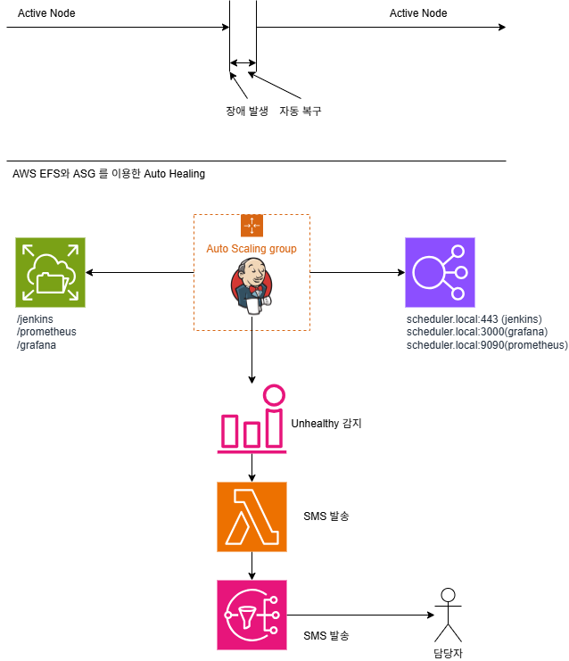
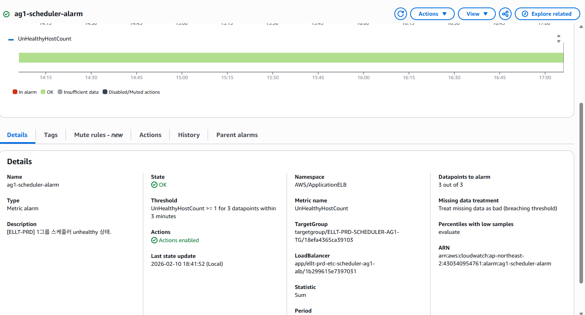

Jenkins를 이용한 배치 스케줄러 구축
========================

#### 배경 
사내 통합 스케줄러 서버의 유지보수계약이 종료되면서  각 애자일 그룹별로 배치 스케줄러를 구축 요구가 제기 되었습니다. 

#### 문제
1. 한대의 스케줄러에서 장애 발생 시 3개 애자일 그룹의 배치 작업이 중지 된다. 
2. HA 구성이 수동으로 되어 있다. 
3. RTTM, RTO 그밖에 모니터링 지표가 설정되어 있지 않다. 


최초의 구성에서는 사람이 장애를 인지하면 직접 Passive 서버로 접속해서 Active 서버를 fencing하고 Passive 서버에서 ETL/스케줄링 프로세스를 실행시켜야 하는  절차를 가지고 있었습니다. 
그리고 Passive 서버에서 ETL/스케줄링 작업 수행하다가 다시 failback을 하려면 Active 서버로 위의 과정을 역순으로 진행해야 했습니다. 
이건 운영자가 24시간 대기하지 않는다면 장애 시간이 길어지는 것은 물론 failback을 하는때에도  모든 스케줄링 작업이 중단되는 예정된 장애를 초래하는 구성입니다.

#### 설계 
설계의 중점은 RTO, RTTM의 개선과 서버간의 장애 전파 격리를 염두하고 진행 했습니다.
기본 요구 사항
1. AWS ASG를 이용해서 Auto Healing 구현
2. AWS EFS를 이용해서 각 인스턴스가 사용하는 Permanent Storage를 제공
3. ASG에 EC2 ,ELB 헬스체크를 이용해서 스케줄러 자체의 상태를 모니터링 하도록 구성 
4. AWS Cloudwatch Alarm을 이용해서 이상 상태 발생 시 담당자에게 알람 전송



##### 컨테이너 환경 설치
아래의 명령으로  docker와 docker-compose를 설치 합니다. 
```
# Installing Docker
sudo dnf install -y docker
sudo usermode -aG docker appe
sudo systemctl enable --now docker 
```
docker-compose 설치
```
# Installing docker-compose
sudo mkdir -p /usr/local/lib/docker/cli-plugins/
sudo curl -SL "https://github.com/docker/compose/releases/latest/download/docker-compose-linux-$(uname -m)" -o /usr/local/lib/docker/cli-plugins/docker-compose
sudo chmod +x /usr/local/lib/docker/cli-plugins/docker-compose
```
우리의 환경에 맞는 Jenkins docker image를 빌드 합니다. 
이 때 내장 시킬 플러그인이나 설정값을 파악하기 위해서 에자일 그룹에게 먼저 Native 환경에서 설치된 Jenkins를 제공하고 피드백을 받아서 플러그인과 설정을 수집했습니다.
아래의   Dockerfile을 이용해서 jenkins image 를 빌드 합니다. 
```
#Dockerfile
FROM jenkins/jenkins:2.530.2-jdk21
USER root
RUN apt-get update && apt-get install -y lsb-release
RUN curl -fsSLo /usr/share/keyrings/docker-archive-keyring.asc \
  https://download.docker.com/linux/debian/gpg
RUN echo "deb [arch=$(dpkg --print-architecture) \
  signed-by=/usr/share/keyrings/docker-archive-keyring.asc] \
  https://download.docker.com/linux/debian \
  $(lsb_release -cs) stable" > /etc/apt/sources.list.d/docker.list
RUN apt-get update && apt-get install -y docker-ce-cli  jq
RUN apt-get install -y graphviz && apt-get install -y fonts-nanum-* && fc-cache -f -v
USER jenkins
RUN jenkins-plugin-cli --plugins "blueocean docker-workflow json-path-api"
RUN jenkins-plugin-cli --plugins "depgraph-view:1.0.5"
RUN jenkins-plugin-cli --plugins "extra-columns:1.27"
RUN jenkins-plugin-cli --plugins "extended-timer-trigger:30.vb_fb_7092cccfa_"
RUN jenkins-plugin-cli --plugins "disable-job-button:1.3.vf55949267366"
RUN jenkins-plugin-cli --plugins "jobConfigHistory:1356.ve360da_6c523a_"
```
```
sudo docker image build -t jenkins-scheduler . 
```
jenkins가 완성이 되었으면 모니터링을 위한 나머지 요소들까지 포함한 docker-compose.yaml을 만들어야 합니다.
이 yaml에는 사용할 jenkins image와 이 서버를 모니터링 할 여러 요소들 (prometheus, grafana, node_exporter, cAdvisor)까지 하나의 명령으로 
수행될 수 있도록 구성 합니다. 
```
services:
  prometheus:
    image: prom/prometheus:latest
    container_name: prometheus
    logging:
      driver: "json-file"
      options:
        max-size: "10m"
        max-file: "3"
    user: "2000:2000"
    environment:
      - TZ=Asia/Seoul
    restart: always
    networks:
      - scheduler-net
    ports:
      - 9090:9090
    volumes:
      - ./prometheus/data:/prometheus
      - ./prometheus/etc:/etc/prometheus
    command:
      - '--config.file=/etc/prometheus/prometheus.yml'
      - '--storage.tsdb.path=/prometheus'
      - '--web.console.libraries=/usr/share/prometheus/console_libraries'
      - '--web.enable-lifecycle'
    healthcheck:
      test: ["CMD", "wget", "--tries=1", "--spider", "http://localhost:9090/-/healthy"]
      interval: 10s
      timeout: 5s
      retries: 3
  grafana:
    image: grafana/grafana:latest
    user: "2000:2000"
    container_name: grafana
    logging:
      driver: "json-file"
      options:
        max-size: "10m"
        max-file: "3"
    restart: always
    ports:
      - 3000:3000
    networks:
      - scheduler-net
    volumes:
      - ./grafana/data:/var/lib/grafana
    environment:
      - GF_SECURITY_ADMIN=admin
      - GF_SECURITY_ADMIN_PASSWORD=admin
      - GF_USERS_ALLOW_SIGN_UP=true
      - TZ=Asia/Seoul
  jenkins:
    image: jenkins-scheduler:latest
    container_name: scheduler
    logging:
      driver: "json-file"
      options:
        max-size: "10m"
        max-file: "3"
    restart: always
    user: root
    environment:
      - TZ=Asia/Seoul
    ports:
      - "8080:8080"
      - "50000:50000"
    networks:
      - scheduler-net
    volumes:
      - ./jenkins_home:/var/jenkins_home
  node-exporter:
    image: prom/node-exporter:latest
    container_name: node-exporter
    restart: unless-stopped
    volumes:
      - /proc:/host/proc:ro
      - /sys:/host/sys:ro
      - /:/rootfs:ro
    command:
      - '--path.procfs=/host/proc'
      - '--path.rootfs=/rootfs'
      - '--path.sysfs=/host/sys'
      - '--collector.filesystem.mount-points-exclude=^/(sys|proc|dev|host|etc)($$|/)'
    ports:
      - 9100:9100
    networks:
      - scheduler-net
  cadvisor:
    container_name: cadvisor
    image: gcr.io/cadvisor/cadvisor:latest
    networks:
      - scheduler-net
    ports:
      - 9080:8080
    volumes:
      - "/:/rootfs"
      - "/var/run:/var/run"
      - "/sys:/sys"
      - "/var/lib/docker/:/var/lib/docker"
      - "/dev/disk/:/dev/disk"
    devices:
      - "/dev/kmsg"

networks:
  scheduler-net:
    driver: bridge
```
여기까지 설정하면 이제 docker-compose start 혹은 up 명령으로 모든 컨테이너를 구동시키고 jenkins, prometheus, grafana, node_exporter, cAdvisor까지 
구동되는 것을 확인할 수 있습니다. 

* grafana docker : http://grafana.com/docs/grafana/latest/setup-grafana/installation/docker/
* prometheus docker : https://prometheus.io/docs/prometheus/latest/installation/
* node exporter : https://hub.docker.com/r/prom/node-exporter
* ref : https://medium.com/@sohammohite/docker-container-monitoring-with-cadvisor-prometheus-and-grafana-using-docker-compose-b47ec78efbc 

##### 2. AWS EFS를 이용해서 각 인스턴스가 사용하는 Permanent Storage를 제공
AWS EFS(Elastic File System)은 NFSv4를 기반으로 하는 네트워크 파일 시스템 입니다.
젠킨스나 프로메테우스등이 파일을 기반으로 서비스 되기 때문에 ASG에 의해서 EC2 인스턴스가 변경되는 경우에도 모든 파일이 지속적으로 
인계되어야 하기 때문에 AWS EFS를 사용하기로 결정 했습니다. 
AWS EFS로 각 서버가 사용할 파일 시스템을 만들어서 EC2인스턴스에 연결해주면 작업은 끝난다. [AWS EFS 파일 시스템 생성](https://docs.aws.amazon.com/ko_kr/efs/latest/ug/creating-using-create-fs.html)
이렇게 만들어진 EFS 볼륨에 docker-compose에 연관된 모든 파일이 저장되도록 설정한다.
```
[root@scheduler scheduler]# ls -al
total 2076
-rw-r--r--.  1 appexec appexec       2537 Jan 29 12:06 compose.yml
drwxr-xr-x.  3 appexec appexec    6144 Jan 29 07:25 grafana
drwxr-xr-x.  2 appexec appexec    6144 Jan 29 07:56 jenkins
drwxr-xr-x. 16 appexec appexec    6144 Feb 23 05:32 jenkins_home
drwxr-xr-x.  4 appexec appexec    6144 Jan 29 07:26 prometheus
```

##### 3. ASG에 EC2 ,ELB 헬스체크를 이용해서 스케줄러 자체의 상태를 모니터링 하도록 구성 
AWS ALB에서 health check 옵션을 다음과 같이 세팅 한다. 
젠킨스 타겟그룹,  그라파나 타겟그룹, 프로메테우스 타겟그룹을 생성하고 각 타겟그룹의 특성에 맞는 health check 파라메터를 입력한다. 

* Health checks for Application Load Balancer target groups: https://docs.aws.amazon.com/elasticloadbalancing/latest/application/target-group-health-checks.html
##### 4. AWS Cloudwatch Alarm을 이용해서 이상 상태 발생 시 담당자에게 알람 전송
AWS CloudWatch SNS을 이용해서 SMS(문자메시지)를 받기 위해선 리전에 따라 다르지만 우리가 사용하는 리전은 SMS발송이 안되기 때문에 
부득이하게 다른 리전을 사용하게 되면서 발생한 문제가 AWS CloudWatch Alarm을 이용해서 SNS에 직업 호출하지 못한다는 문제가 있다. 
따라서 AWS CloudWatch에서 AWS Lambda를 호출하고 이 Lambda가 다른 리전에 있는 SNS에 메시지를 발송할 수 있도록 해야 한다. 
* Invoke a Lambda function from an alarm https://docs.aws.amazon.com/AmazonCloudWatch/latest/monitoring/alarms-and-actions-Lambda.html

##### EFS 비용 이슈
EFS는 Elastic, Provisioned, Burst  이렇게 3종류의 옵션이 있다. 
1. Elastic : 제일 비싸지만 가장 탄력적을 운영된다. 보통 Throughput Utilize 를 모니터링하면 바닥에 붙어 다닌다. 
2. Provisioned: 정해진  IOPS와 throughput을 제공받고 정한 범위에서는 성능이 준수하다. 
3. Burst : EC2의 T계열에서 볼 수 있는  CPU Burst와 같다. IO Credit을 모두 소모하면 성능이 심각하게 떨어져서 운영환경에서는 사용하지 어렵다.
처음에 Burst 로 했다가 IOCredit이 0에 도달한 후 Latency가 너무 느려져서 EC2들이 ASG에 의해서 모두 대체된 적인 있습니다. 
현재는 Provisioned 로 사용 중이고 서비스에는 지장이 없습니다. Provisioned 로 바로 사용하려면 원하는  Throughput을 알아야하는데 이를 위해서 먼저  Elastic 으로 사용해보고
Throughput을 특정하는 방법을 추천합니다. 


##### 5. 예상비용
예상비용 
* 개발계 t3.large x 3 EA = $ 137.53 /월
* 운영계 m5.xlarge x 3EA = $ 312.93 / 월 
* EFS x 6EA = 운영 (495 * 3) + 개발(165 * 3)  =  $1,872 /월 
합계 (약) $ 2,330 / 월 

